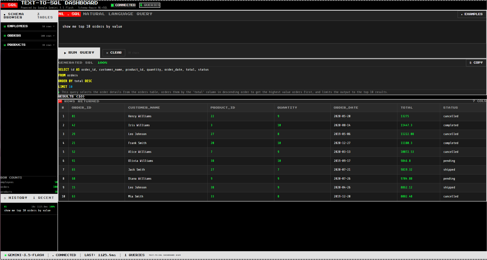

# ⬛ TEXT-TO-SQL DASHBOARD

> **LLM-powered natural language database search interface powered by Google Gemini 3.5 Flash**

A full-stack project featuring schema-aware prompt engineering, typed structured output contracts, and a high-contrast Metro UI with Minecraft retro aesthetics.

---

## 📷 Interface Preview



### What's shown in the preview:
1. **Header Panel**: Displays system connection status (`CONNECTED`), the active model (`Google Gemini 3.5 Flash`), and query count metrics.
2. **Schema Browser (Left Sidebar)**: Introspects the SQLite database dynamically, displaying the active tables (`EMPLOYEES`, `ORDERS`, `PRODUCTS`), column types, and total row counts.
3. **Query History (Left Sidebar)**: Logs executed natural language queries, showing their status, row counts, response time in ms, and LLM confidence. Clicking history logs allows you to view the SQL query.
4. **Natural Language Input Panel**: The active input contains the question: *"show me top 10 orders by value"*.
5. **Generated SQL Panel**: Displays the syntax-highlighted SQL query generated by Gemini:
   ```sql
   SELECT id AS order_id, customer_name, product_id, quantity, order_date, total, status 
   FROM orders 
   ORDER BY total DESC 
   LIMIT 10
   ```
   along with a confidence score of `100%` and a plain-English explanation.
6. **Results Panel**: Shows the query results rendered in a structured, sortable high-contrast Metro table containing the top 10 orders ordered by total value descending.
7. **Status Bar (Bottom)**: Displays live health diagnostics (model version, server connection, last latency response: `1125.8ms`, and global query count).

---

## ⚙️ How It Works

1. **Database Introspection**:
   On startup, the Python backend introspects the SQLite database schema (`schema_manager.py`). It fetches table names, columns, data types, and primary/foreign key relationships.
2. **Schema-Aware Prompting**:
   When a user types a natural language question, the backend retrieves the schema representation (DDL) and packages it alongside rules (like SELECT-only limits) into a structured system prompt template.
3. **Inference & Structured Contracts**:
   The backend sends this payload to the Google Gemini API (`gemini_client.py`). It targets `gemini-3.5-flash` with a configured structured output contract (`responseMimeType: "application/json"`) and disables internal reasoning (`thinkingBudget: 0`) to optimize latency. The structured output is validated via a strict Pydantic model (`GeminiSQLResponse`). This ensures the model only returns a JSON containing `sql`, `explanation`, and `confidence`.
4. **Safety Verification**:
   Before running the SQL on the database, the generated query is checked by `query_validator.py` to ensure it contains only read-only `SELECT` statements (blocking operations like `DROP`, `INSERT`, `UPDATE`, `DELETE`, etc.), uses valid table names, and adheres to a single-statement policy.
5. **Execution & UI Render**:
   If validation passes, the SQLite engine executes the query and returns the results to the Flask API. The React frontend receives the payload, parses it, updates the history state, highlights the SQL, and displays the rows in a retro sortable data table.

---

## ✨ Features

- **Natural Language → SQL**: Ask your database anything in plain English
- **Gemini 3.5 Flash**: Fast, accurate SQL generation with schema-aware prompting
- **85–90% Query Accuracy**: Via schema injection + structured JSON output contracts
- **SQL Safety**: SELECT-only whitelist, injection guard, multi-statement block
- **Metro UI**: High-contrast black/white, Press Start 2P Minecraft font
- **Live Schema Browser**: Explore tables, columns, types, and row counts
- **Query History**: Revisit previous queries with confidence scores and latency
- **Syntax Highlighting**: Color-coded SQL keywords, tables, strings, numbers
- **Sortable Results Table**: Click columns to sort, paginated at 25 rows

---

## 🏗 Architecture

```
text-to-sql/
├── backend/
│   ├── app.py              ← Flask API (schema, query, history, health)
│   ├── gemini_client.py    ← Gemini Flash integration + Pydantic contracts
│   ├── schema_manager.py   ← SQLite schema introspection + DDL builder
│   ├── query_validator.py  ← SQL safety validator (SELECT-only)
│   ├── sample_db.py        ← SQLite seeder (employees, products, orders)
│   └── requirements.txt
└── frontend/
    └── src/
        ├── App.jsx
        ├── components/
        │   ├── QueryInput.jsx    ← NL input with example queries
        │   ├── SchemaPanel.jsx   ← Schema browser sidebar
        │   ├── SqlViewer.jsx     ← SQL display with syntax highlight
        │   ├── ResultsTable.jsx  ← Sortable results grid
        │   ├── HistoryPanel.jsx  ← Query history log
        │   └── StatusBar.jsx     ← Metro status bar
        └── utils/sqlHighlight.jsx
```

---

## 🚀 Quick Start

### 1. Backend

```powershell
cd backend
pip install -r requirements.txt
python sample_db.py     # Seeds the SQLite database
python app.py           # Starts Flask on http://localhost:5000
```

### 2. Frontend

```powershell
cd frontend
npm install
npm run dev             # Starts Vite on http://localhost:5173
```

Open **http://localhost:5173** in your browser.

---

## 🗄 Sample Database

| Table | Rows | Description |
|-------|------|-------------|
| `employees` | 50 | id, name, department, salary, hire_date, is_active |
| `products` | ~43 | id, name, category, price, stock |
| `orders` | 100 | id, customer_name, product_id, quantity, order_date, total, status |

### Example Queries

- *"Show me the top 5 highest paid employees"*
- *"List all Electronics products with price over 100"*
- *"What is the average salary by department?"*
- *"How many orders are pending?"*
- *"Which customer placed the most orders?"*

---

## 🔌 API Endpoints

| Method | Route | Description |
|--------|-------|-------------|
| GET | `/api/health` | Health check + model name |
| GET | `/api/schema` | Full schema DDL + column info + row counts |
| POST | `/api/query` | NL → Gemini → SQL → execute → results |
| GET | `/api/history` | Last 20 queries with metadata |

### POST `/api/query` Request
```json
{ "question": "Show me the top 5 highest paid employees" }
```

### POST `/api/query` Response
```json
{
  "success": true,
  "sql": "SELECT name, salary FROM employees ORDER BY salary DESC LIMIT 5",
  "explanation": "Retrieves the 5 employees with the highest salaries...",
  "confidence": 0.97,
  "results": { "columns": ["name", "salary"], "rows": [...], "row_count": 5 },
  "elapsed_ms": 412.3
}
```

---

## 🛡 Security

- Only `SELECT` statements are permitted
- Blocks: DROP, DELETE, INSERT, UPDATE, ALTER, TRUNCATE, EXEC, PRAGMA, `--`, `/*`
- Single-statement enforcement (no `;` injection)
- Table existence validation against live schema

---

## 🎨 Design System

- **Font**: Press Start 2P (Minecraft retro pixel) + Share Tech Mono
- **Palette**: Pure `#000000` / `#FFFFFF` + `#FF0000` accent (Metro red)
- **Language**: Flat rectangular tiles, 2px borders, no border-radius
- **Animations**: Pixel block spinner, slide-in, cursor blink
